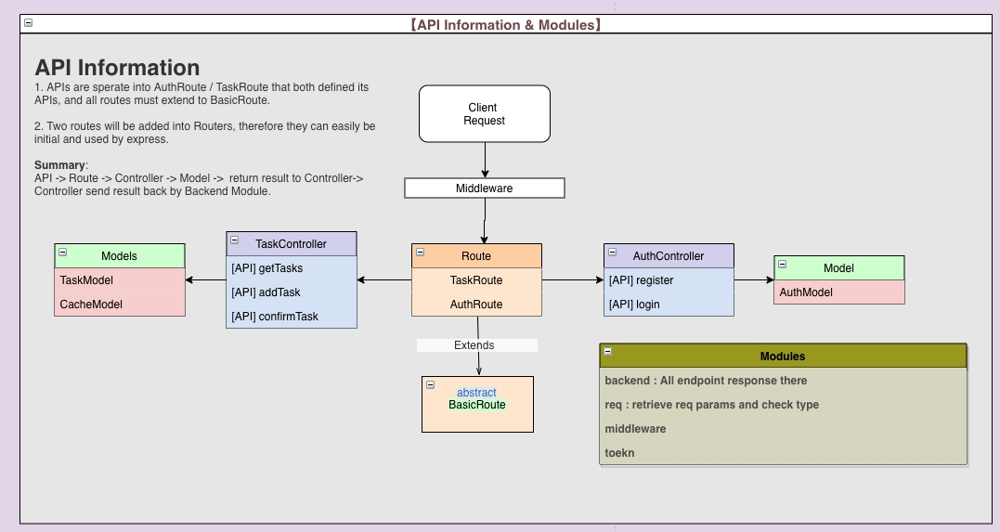
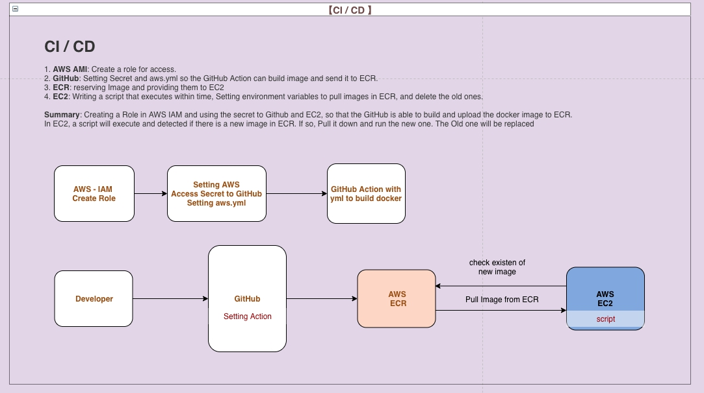
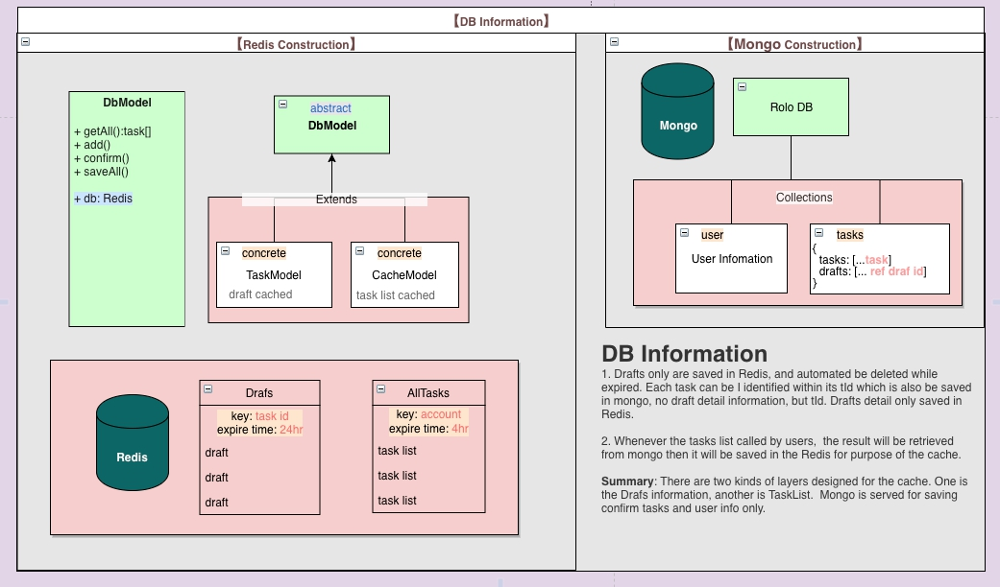
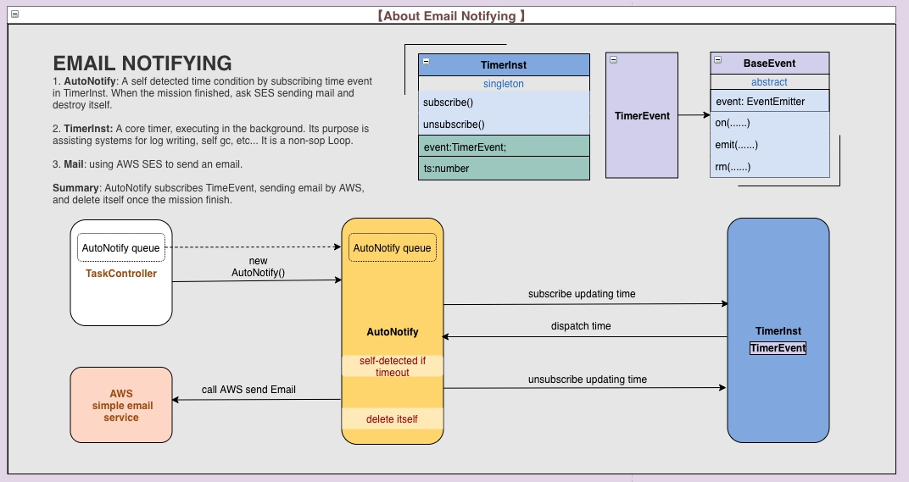

# TaskManagement (Todolist) in NodeJS with CICD
This is the first server mvc project I built in NodeJS (TS) with CICD many years ago, so it was rough. 

Backend:
* A user is able to submit a task through an endpoint.
* The backend will consume the task (a random timer delay).
* Through another endpoint, the user can check the status of the task.
* A task is first created as draft with a 24h life time, it needs to be confirmed to be added to the task queue.
* Use Redis to store and expire the drafts
* Assign a creator to each task. Have one endpoint to create a user (name/email), and one to get all the tasks for a given email
* Once a task has been consumed, notify its creator by email
* Create an authentication procedure between the client and the server using a HMAC signature

DevOps:
* Deploy the application on AWS
* Make the app buildable as a container
* Make a Docker Compose file for the app

## tec stacks
- Nodejs
- Express
- MongoDB
- Redis
- Docker
- githubAction (CI)
- AWS(CD)
- Swagger

## structure

